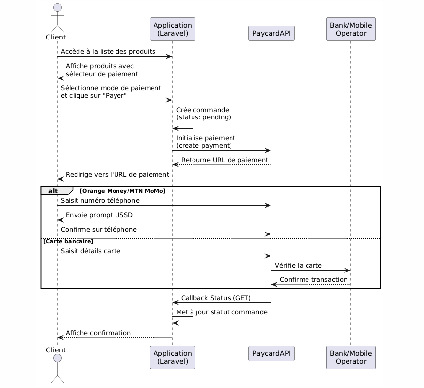

# Intégration Paycard dans Laravel

Ce projet démontre l'intégration de Paycard dans une application Laravel pour gérer les paiements via Orange Money, MTN MoMo, Carte bancaire et Paycard.

## Flux de paiement

Le diagramme suivant illustre le processus complet de paiement, de la sélection du produit jusqu'à la confirmation de la transaction :



## Prérequis

1. **Clé API Paycard**
   - Contactez Paycard via leur page de [contact](https://paycard.co/contact) pour obtenir une clé API

2. **Environnement technique**
   - PHP >= 8.2
   - Laravel >= 11.x
   - Docker (pour Laravel Sail)
   - Composer

## Installation

1. **Cloner et installer le projet**
```bash
git clone https://github.com/bmsanoussy/paycard-laravel
cd paycard-laravel
composer install
```

2. **Configuration**
```bash
cp .env.example .env
# Ajoutez votre clé API dans .env :
# PAYCARD_API_KEY=votre-cle-api
```

3. **Lancer l'application**
```bash
./vendor/bin/sail up -d
./vendor/bin/sail artisan migrate --seed
```

## Points importants

### Configuration du callback

⚠️ **Important**: Configurez le callback en GET pour éviter l'erreur 419 CSRF
```php
$paymentData = [
    // ...
    'callback_url' => route('payment.callback'),
    'auto_redirect' => true,
    'redirect_with_get' => true  // Assurez-vous que cette option est à true
];
```

### Modes de paiement supportés
- Orange Money Guinea
- MTN Mobile Money
- Cartes Visa/Mastercard
- Paycard

### Structure du paiement
1. Client sélectionne un produit et mode de paiement
2. Application crée la commande et initialise le paiement Paycard
3. Client est redirigé vers la page de paiement
4. Paycard envoie un callback GET avec le statut
5. Application met à jour le statut de la commande

## Routes principales
```php
Route::get('/', [ProductController::class, 'index'])->name('products.index');
Route::post('/payment/initiate', [PaymentController::class, 'initiate'])->name('payment.initiate');
Route::get('/payment/callback', [PaymentController::class, 'callback'])->name('payment.callback');
```

## Troubleshooting

1. **Erreur 419 (CSRF)**
   - Vérifiez que `redirect_with_get` est à `true`
   - Le callback doit être en GET

2. **Erreur d'API**
   - Vérifiez la validité de votre clé API
   - Consultez les logs Laravel : `sail artisan log:tail`